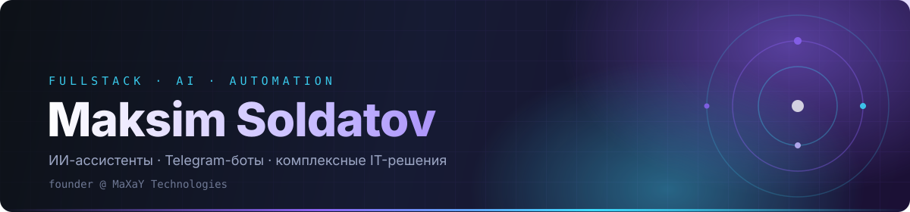

<div align="center">



<br/><br/>


<br/><br/>

<a href="https://t.me/maxaydev">
  
</a>
<a href="mailto:soldatovmaksim536@gmail.com">
  
</a>
<a href="https://github.com/maxaysoldatov9">
  
</a>

</div>

<br/>

## ⚡ Обо мне

```yaml
name:      Maksim Soldatov
role:      Fullstack Developer
company:   MaXaY Technologies (founder)
focus:     [ AI-ассистенты, Telegram-боты, backend, интеграции ]
stack:     [ Python, JavaScript, Node.js, React, C++ ]
status:    открыт к интересным проектам
```

- 🧠 Разрабатываю **умных ИИ-ассистентов** и автоматизированные системы
- 🤖 Создаю **Telegram-ботов** любой сложности — от MVP до продакшена
- 🏗️ Строю **комплексные IT-решения**: backend, API, интеграции
- 🚀 Основатель студии **MaXaY Technologies**
- 🌱 Постоянно изучаю новое в AI/ML и современном вебе

---

## 🧰 Технологический стек

<div align="center">


<br/>


</div>

---

## 📊 GitHub-статистика

<div align="center">


<br/>


</div>

<p align="center">
  <sub>📈 Статистика формируется автоматически через
  <a href="https://github.com/anuraghazra/github-readme-stats">github-readme-stats</a> и
  <a href="https://github.com/DenverCoder1/github-readme-streak-stats">streak-stats</a></sub>
</p>

---

## 📫 Связаться со мной

<div align="center">

| | |
|:--|:--|
| 💬 **Telegram** | [@maxaydev](https://t.me/maxaydev) — самый быстрый способ |
| 📧 **Email** | [soldatovmaksim536@gmail.com](mailto:soldatovmaksim536@gmail.com) |
| 🌐 **GitHub** | [maxaysoldatov9](https://github.com/maxaysoldatov9) |

</div>

<br/>

<div align="center">

### 🌌 «Я не мечтаю о будущем — я его создаю.»

<sub>MaXaY Technologies</sub>

</div>
